# MikroTik X Cisco: VLAN

## VLAN (Virtual Local Area Network) configuration with MikroTik router and Cisco layer-2 switch.

### VLAN network scheme
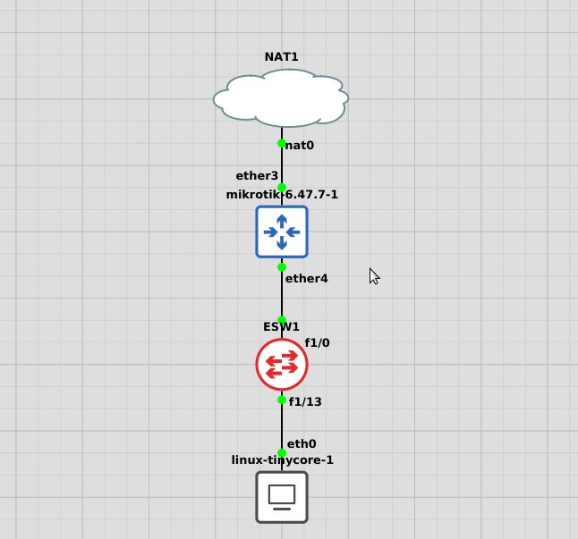

### Configure layer-2 switch (Cisco)
```
config t

! Create vlan 10
vlan
vlan 10
name vlan10
exit

! Create vlan 20
vlan
vlan 20
name vlan20
exit

! Interface fa1/0 trunk port
int fa1/0
switchport mode trunk
exit

! Interface fa1/1 to fa1/8 vlan 10
int range fa1/1 - 8
switchport mode access
switchport access vlan 10
exit

! Interface fa1/9 to fa1/15 vlan 20
int range fa1/9 - 15
switchport mode access
switchport access vlan 20
exit
exit

```
### Verify configurations layer-2 switch (Cisco)
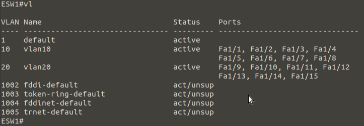

### Configure router (MikroTik)
```
# Create vlan 10
/interface vlan add interface=ether4 name=vlan10 vlan-id=10
# Create vlan 20
/interface vlan add interface=ether4 name=vlan20 vlan-id=20
# ip dhcp server pool vlan 10
/ip pool add name=dhcp_pool0 ranges=10.10.10.1-10.10.10.125
# ip dhcp server pool vlan 20
/ip pool add name=dhcp_pool1 ranges=10.100.100.1-10.100.100.125
# Router ip address
/ip address add address=10.10.10.126/25 interface=vlan10 network=10.10.10.0
/ip address add address=10.100.100.126/25 interface=vlan20 network=10.100.100.0
# dhcp server vlan 10
/ip dhcp-server add address-pool=dhcp_pool0 disabled=no interface=vlan10 lease-time=5m name=dhcp1
/ip dhcp-server network add address=10.10.10.0/25 gateway=10.10.10.126
# dhcp server vlan 20
/ip dhcp-server add address-pool=dhcp_pool1 disabled=no interface=vlan20 lease-time=5m name=dhcp2
/ip dhcp-server network add address=10.100.100.0/25 gateway=10.100.100.126
# Configure internet access all clients
# Interface out internet access
/ip dhcp-client add disabled=no interface=ether3
# Clients allow remote requests
/ip dns set allow-remote-requests=yes
# NAT

```
### Verify configurations router (MikroTik)
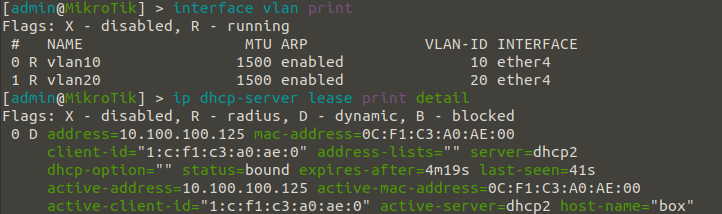

### Verify configurations client
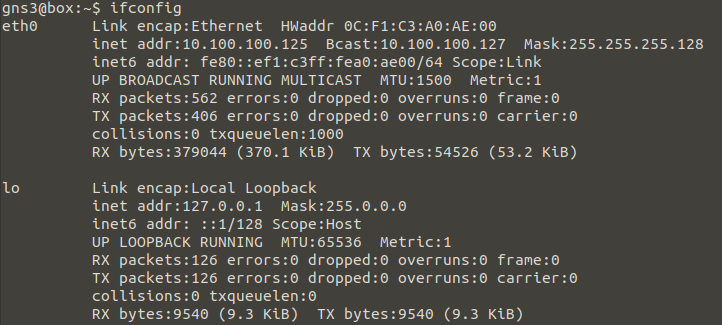
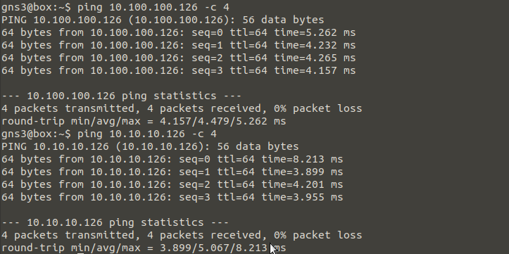
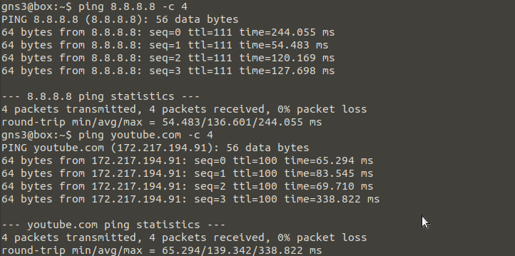

** **

## VLAN (Virtual Local Area Network) configuration with Cisco router and layer-2 switch.

### VLAN network scheme
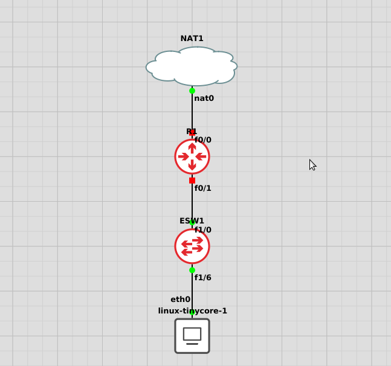

### Configure layer-2 switch (Cisco)
```
config t

! Create vlan 10
vlan
vlan 10
name vlan10
exit

! Create vlan 20
vlan
vlan 20
name vlan20
exit

! Interface fa1/0 trunk port
int fa1/0
switchport mode trunk
exit

! Interface fa1/1 to fa1/8 vlan 10
int range fa1/1 - 8
switchport mode access
switchport access vlan 10
exit

! Interface fa1/9 to fa1/15 vlan 20
int range fa1/9 - 15
switchport mode access
switchport access vlan 20
exit
exit

```
### Verify configurations layer-2 switch (Cisco)


### Configure router (Cisco)
```
config t

! Router ip address vlan 10 and vlan 20
int fa0/1
no ip address
no shutdown
exit

int fa0/1.10
encapsulation dot1Q 10
ip address 10.10.10.126 255.255.255.128
no shutdown
exit

int fa0/1.20
encapsulation dot1Q 20
ip address 10.100.100.126 255.255.255.128
exit

! ip dhcp server pool vlan 10 and vlan 20
ip dhcp excluded-address 10.10.10.126 10.100.100.126

ip dhcp pool vlan10
network 10.10.10.0 255.255.255.128
default-router 10.10.10.126
exit

ip dhcp pool vlan20
network 10.100.100.0 255.255.255.128
default-router 10.100.100.126
exit

! Configure internet access all clients
! Interface out internet access
int fa0/0
ip address dhcp
no shutdown
exit

! access-list NAT
access-list 1 permit 10.10.10.0 0.0.0.127
access-list 1 permit 10.100.100.0 0.0.0.127

! Interface NAT
ip nat inside source list 1 int fa0/0 overload

int fa0/0
ip nat outside
exit

int fa0/1
ip nat inside
exit

int fa0/1.10
ip nat inside
exit

int fa0/1.20
ip nat inside
exit
ip domain lookup
ip domain-lookup
ip name-server 8.8.8.8

exit

```
### Verify configurations router (Cisco)
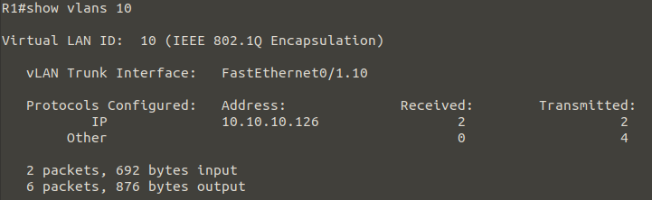
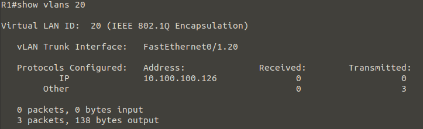
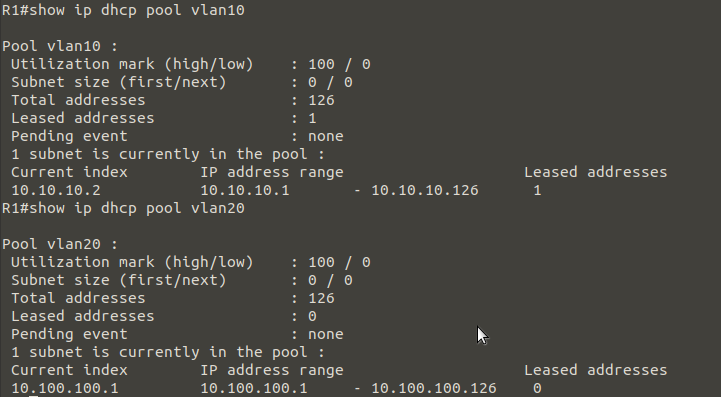
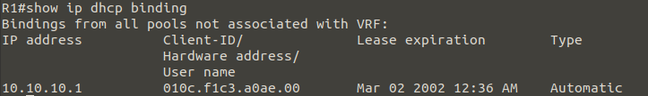

### Verify configurations client
`sudo vi /etc/resolv.conf`
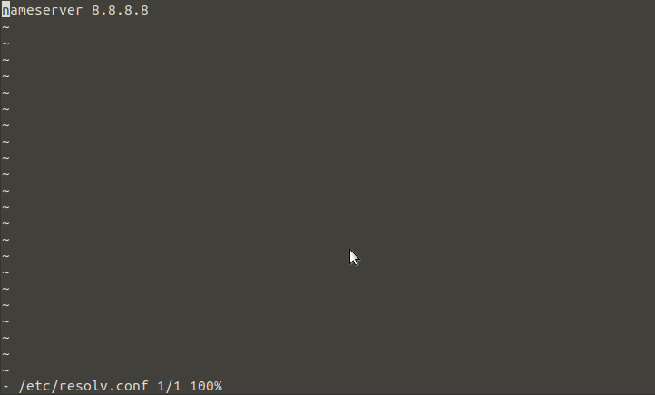
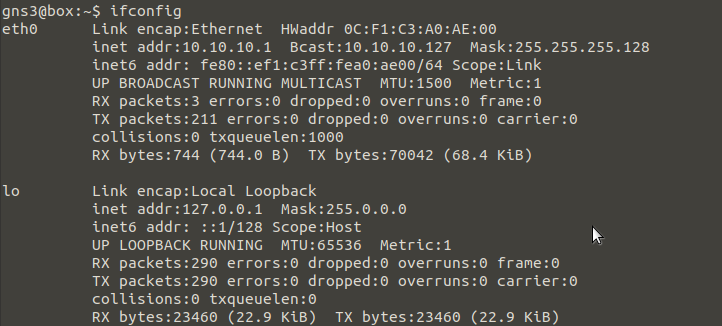
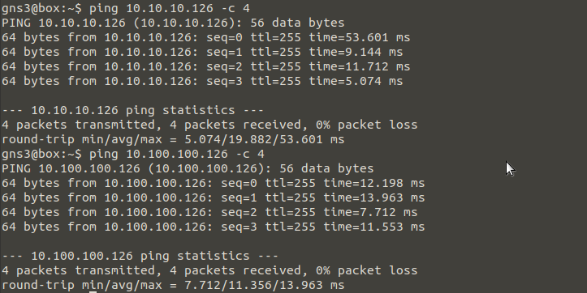
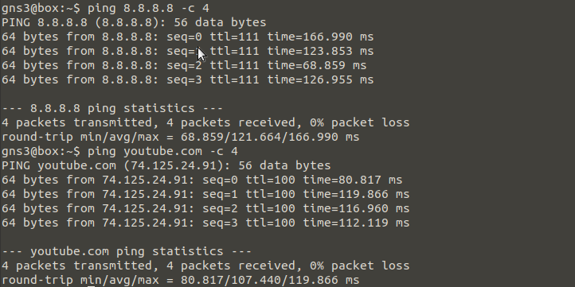

** **

**NOTE:**<br>
NAT node is allows to connect a topology to internet via NAT. By default, NAT node runs a DHCP server with a predefined pool in the 122.0/24 range.<br>
Inter-vlan configuration 1 router port dot1Q mode with 1 switch port trunk mode and others switch port access mode.<br>
Tools<br>
GNS3 version 2.2.15<br>
Cisco IOS C3725 (Dynamips)<br>
MikroTik RouterOS 6.47.7 (Qemu VM)<br>
Linux 3.16.6-tinycore (Qemu VM)<br>
Host<br>
Ubuntu Release 20.04.2 LTS (Focal Fossa) 64-bit Kernel Linux 5.4.0-1032-raspi aarch64 MATE 1.24.0<br>
Raspberry Pi 4 ARM 64-bit 4GB RAM
